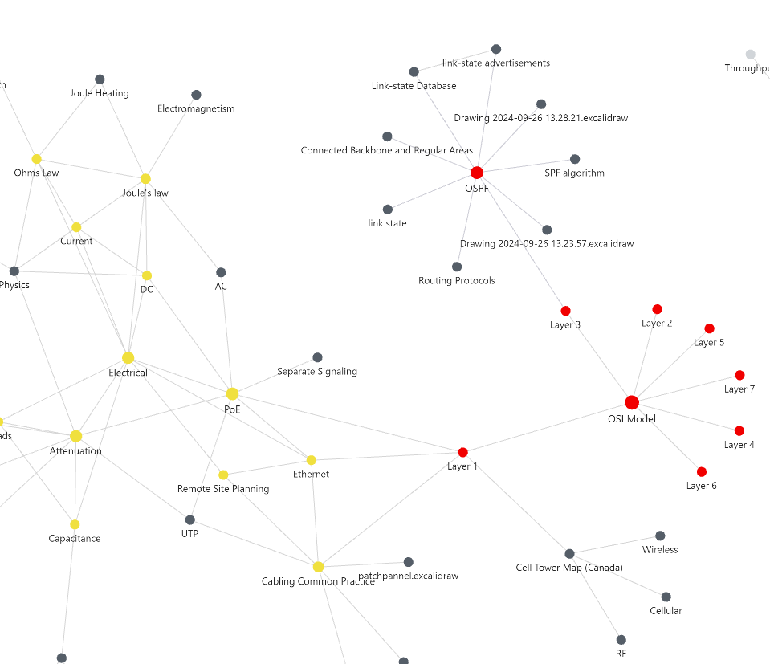

# My Networking Obsidian Database
Just a work-in-progress vault used to take notes related to network engineering. Looking to publish this on an online obsidian notes viewer in the future, for ease of access. I have lots of notes, but it will take a while to fully upload.

What's cooler than making a notes network for networking?!

# Quick links:
[[How I use]]
[[Objective]]

